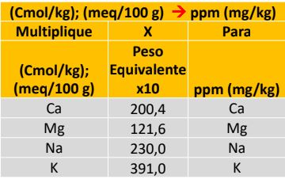

<html>

 
<table border="4" >

 <tr>
  <td  bgcolor="moccasin">
  

  {height=160px} 

  
Fuente: Diego R. Villaseñor Ortiz 

 
   <body>
     
<b>Calculo de bases</b>
  
   </body>
  <body>
    <form name="MyForm">
      Ingrese calcio (mq):<input type="text" name="numero1" size="20">  
      Ingrese calcio(mg/Kg):<input type="text" name="numero2" size="20">  
     Resultado en (mg/Kg)Ca:        <input type="text" name="resultado" size="20">  
     
<input type="button" value="Calcular" onclick="ca()">
<input type="reset" value="Eliminar">
         
  </form>

  
    <body>
    <form name="MyForm2">
      Ingrese magnesio (mq):<input type="text" name="numero3" size="20">  
      Ingrese magnesio(mg/Kg):<input type="text" name="numero4" size="20">  
     Resultado en (mg/Kg)Mg:        <input type="text" name="resultado" size="20">  
     
<input type="button" value="Calcular" onclick="Mg()">
<input type="reset" value="Eliminar">
         
  </form>
  
    <body>
    <form name="MyForm3">
      Ingrese sodio (mq):<input type="text" name="numero5" size="20">  
      Ingrese sodio (mg/Kg):<input type="text" name="numero6" size="20">  
     Resultado en (mg/Kg)Na:        <input type="text" name="resultado" size="20">  
     
<input type="button" value="Calcular" onclick="so()">
<input type="reset" value="Eliminar">
         
  </form>

  
    <body>
    <form name="MyForm4">
      Ingrese potasio (mq):<input type="text" name="numero7" size="20">  
      Ingrese potasio (mg/Kg):<input type="text" name="numero8" size="20">  
     Resultado en (mg/Kg)K:        <input type="text" name="resultado" size="20">  
     
<input type="button" value="Calcular" onclick="POTA()">
<input type="reset" value="Eliminar">
         
  </form>

  
    
  </body>
 </td>
 </tr>
</table>

</html>

<html>

 
<table border="4" >

 <tr>
  <td  bgcolor="moccasin">
   <body>
     
<b>Convertir de mg/Kg a Kg(/Ha)</b>
  
   </body>

  <body>
    <form name="MyForm5">
      Ingrese base(mg/Kg):<input type="text" name="numero4" size="20">  
      Ingrese factor :<input type="text" name="numero5" size="20">  
     Resultado en Kg(/Ha):        <input type="text" name="resultado" size="20">  
     
<input type="button" value="Calcular" onclick="fa()">
<input type="reset" value="Eliminar">
         
  </form>

  
  </body>
 </td>
 </tr>
</table>

</html>
