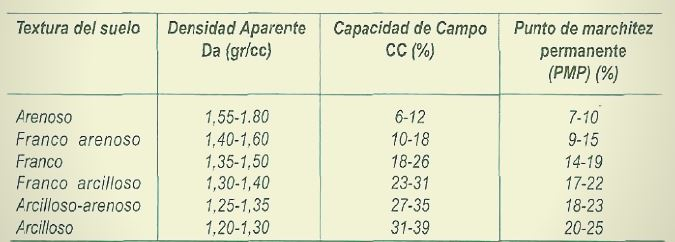

<html>

 
<table border="4" >

 <tr>
  <td  bgcolor="moccasin">
   <body>
    

  {height=160px} 

  
Fuente: 

     
<b>Calcular masa del suelo</b>
  
   </body>

  <body>
    <form name="MyForm">
      Ingrese 1Ha(m2):<input type="text" name="numero1" size="20">  
      Ingrese densidad aparente(T/m3) :<input type="text" name="numero2" size="20">  
      Ingrese profundidad(m):<input type="text" name="numero3" size="20">  
     Resultado en T:        <input type="text" name="resultado" size="20">  
     
<input type="button" value="Calcular" onclick="masa()">
<input type="reset" value="Eliminar">
         
  </form>

  
  </body>
 </td>
 </tr>
</table>

</html>

<html>

 
<table border="4" >

 <tr>
  <td  bgcolor="moccasin">
   <body>
     
<b>Toneladas a Kg</b>
  
   </body>

  <body>
    <form name="MyForm2">
      Ingrese T:<input type="text" name="numero4" size="20">  
      Ingrese 1000 kG :<input type="text" name="numero5" size="20">  
     Resultado en Kg:        <input type="text" name="resultado" size="20">  
     
<input type="button" value="Calcular" onclick="tone()">
<input type="reset" value="Eliminar">
         
  </form>

  
  </body>
 </td>
 </tr>
</table>

</html>