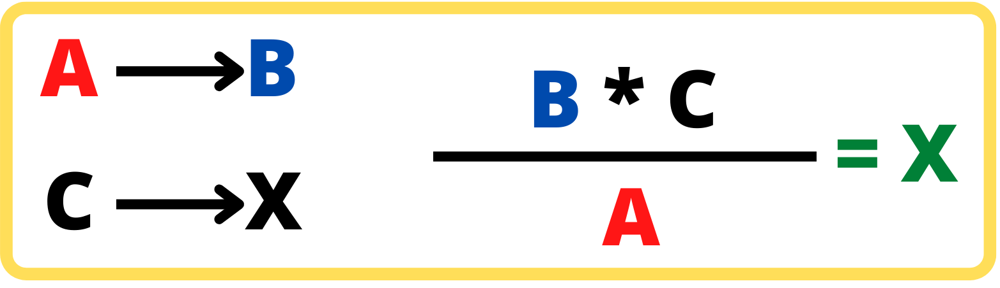

<html>

<head>

 

</head>

   <body>
   

  
<H5>
<b>Calcular regla de tres simple</b>
  </H5>

  <body>
  

  {height=80px} 

    <form name="MyForm">
      Ingrese A:<input type="text" name="numero1" size="20">  
      Ingrese B:<input type="text" name="numero2" size="20">  
      Ingrese c:<input type="text" name="numero3" size="20">  
     Resultado x :        <input type="text" name="resultado" size="20">  
     
<input type="button" value="Calcular" onclick="real()">
<input type="reset" value="Eliminar">
         

  </form>

  
  </body>
 
 
   </body>
   
  

</html>